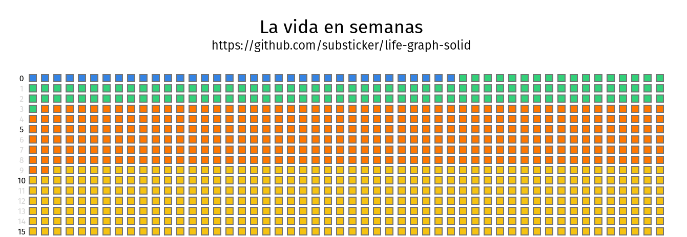

# life-graph-solid
Aplicación hecha experimentando con [SolidJS](https://www.solidjs.com/).  Proyecto inspirado en [Life-Graph (MIT) de K20shores](https://github.com/K20shores/Life-Graph).

## !! Aviso !!
Este repositorio fue hecho en poco tiempo y poco cuidado, eventualmente se irá mejorando y reduciendo la cantidad de problemas que existen dentro del programa. Existen varios a causa de la velocidad en que se quiso tener una primera versión. 

## Instalación
1. Instalar [node.js](https://nodejs.org/en)
2. Clonar este repositorio
3. Instalar dependencias con `npm i` en la consola
4. Iniciar servidor con `npm run dev`
5. Ingresa a la IP que aparece con el navegador web.

## Metas

- [ ] Exportar a imagen
- [ ] Recrear malla en canvas para mejorar renderimiento
- [ ] Añadir dark-mode
- [ ] Mejorar precisión de semanas en años
- [ ] Añadir eventos de un solo día.